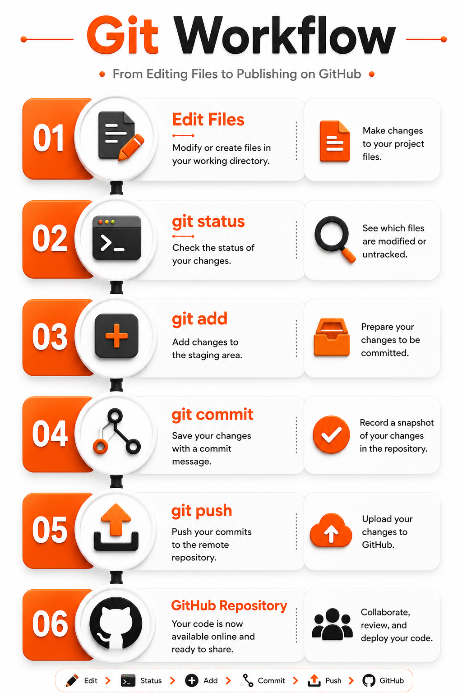

# Git Cheat Sheet

A comprehensive Git and GitHub reference guide featuring practical commands, real-world examples, best practices, and common mistakes for developers.

---

## Table of Contents

- [Introduction](#introduction)
- [Git Configuration](#git-configuration)
- [Repository Commands](#repository-commands)
- [Staging and Commit](#staging-and-commit)
- [Branch Commands](#branch-commands)
- [Remote Repository](#remote-repository)
- [Undo Changes](#undo-changes)
- [Git Workflow](#git-workflow)
- [Best Practices](#best-practices)
- [Common Mistakes](#common-mistakes)
- [Resources](#resources)
- [Author](#author)

---

## Introduction

This project provides a practical Git cheat sheet with the most commonly used commands, organized by category, to help developers work more efficiently with Git and GitHub.

---

## Git Configuration

Configure your Git identity before creating commits.

| Command | Description |
|---------|-------------|
| `git config --global user.name "Your Name"` | Set your Git username. |
| `git config --global user.email "you@example.com"` | Set your Git email address. |
| `git config --list` | Display all Git configuration settings. |

---

## Repository Commands

Commands used to create and manage Git repositories.

| Command | Description | Example |
|---------|-------------|---------|
| `git init` | Initialize a new Git repository. | `git init` |
| `git clone <repository-url>` | Clone an existing repository. | `git clone https://github.com/user/repo.git` |
| `git status` | Show the current repository status. | `git status` |

---

## Staging and Commit

Commands used to stage and save changes.

| Command | Description | Example |
|---------|-------------|---------|
| `git add <file>` | Stage a specific file. | `git add README.md` |
| `git add .` | Stage all modified files. | `git add .` |
| `git commit -m "message"` | Create a commit with a message. | `git commit -m "Add README"` |
| `git commit --amend` | Modify the last commit. | `git commit --amend` |

---

## Branch Commands

Commands used to create and manage Git branches.

| Command | Description | Example |
|---------|-------------|---------|
| `git branch` | List all local branches. | `git branch` |
| `git branch <branch-name>` | Create a new branch. | `git branch feature-login` |
| `git switch <branch-name>` | Switch to another branch. | `git switch main` |
| `git checkout <branch-name>` | Switch branches (legacy command). | `git checkout main` |
| `git merge <branch-name>` | Merge another branch into the current branch. | `git merge feature-login` |

> 💡 **Common Mistake**
>
> Always check your current branch before using `git merge` or `git push`.

---

## Remote Repository

Commands used to connect and synchronize your local repository with GitHub.

| Command | Description | Example |
|---------|-------------|---------|
| `git remote -v` | Show all remote repositories. | `git remote -v` |
| `git remote add origin <repository-url>` | Connect your local repository to GitHub. | `git remote add origin https://github.com/username/git-cheat-sheet.git` |
| `git push -u origin main` | Push your local commits to GitHub. | `git push -u origin main` |
| `git pull origin main` | Download and merge changes from GitHub. | `git pull origin main` |
| `git fetch origin` | Download remote changes without merging them. | `git fetch origin` |

> 💡 **Common Mistake**
>
> Always verify the remote URL with `git remote -v` before pushing your project.

> ✅ **Best Practice**
>
> Use SSH (`git@github.com:...`) instead of HTTPS when possible to avoid entering your credentials repeatedly.

---

## History Commands

Commands used to inspect commits and view changes.

| Command | Description | Example |
|---------|-------------|---------|
| `git log` | Show commit history. | `git log` |
| `git log --oneline` | Display a compact commit history. | `git log --oneline` |
| `git diff` | Show unstaged changes. | `git diff` |
| `git diff --staged` | Show staged changes before committing. | `git diff --staged` |
| `git show` | Display detailed information about a commit. | `git show` |

> 💡 **Common Mistake**
>
> Don't commit changes without reviewing them first using `git diff`.

> ✅ **Best Practice**
>
> Use `git log --oneline` to quickly review your project's commit history.

---

## Undo Changes

Commands used to discard or undo changes safely.

| Command | Description | Example |
|---------|-------------|---------|
| `git restore <file>` | Discard changes in a specific file. | `git restore README.md` |
| `git restore --staged <file>` | Remove a file from the staging area without losing changes. | `git restore --staged README.md` |
| `git reset --soft HEAD~1` | Undo the last commit but keep changes staged. | `git reset --soft HEAD~1` |
| `git reset --hard HEAD~1` | Undo the last commit and discard all changes. | `git reset --hard HEAD~1` |
| `git revert <commit-hash>` | Create a new commit that reverses a previous commit. | `git revert a1b2c3d` |

> 💡 **Common Mistake**
>
> Avoid using `git reset --hard` unless you are certain you no longer need your uncommitted changes.

> ✅ **Best Practice**
>
> Prefer `git revert` instead of `git reset` when working on shared repositories.

---

## Git Tags

Tags are used to mark specific versions of a project, such as releases.

| Command | Description | Example |
|---------|-------------|---------|
| `git tag` | List all tags. | `git tag` |
| `git tag v1.0` | Create a lightweight tag. | `git tag v1.0` |
| `git tag -a v1.0 -m "First release"` | Create an annotated tag. | `git tag -a v1.0 -m "First release"` |
| `git push origin v1.0` | Push a specific tag to GitHub. | `git push origin v1.0` |
| `git push --tags` | Push all tags to GitHub. | `git push --tags` |

> 💡 **Common Mistake**
>
> Creating a tag locally but forgetting to push it to GitHub.

> ✅ **Best Practice**
>
> Use annotated tags for official releases because they include additional metadata.

---

## Git Workflow

The following diagram illustrates the typical Git workflow from editing files to publishing your code on GitHub.

  

> 📌 **This workflow represents the most common Git process used in software development projects.**

### Typical Workflow

1. Edit your project files.
2. Check the current status using `git status`.
3. Stage your changes using `git add`.
4. Save your changes using `git commit`.
5. Push your commits to GitHub using `git push`.

> ✅ **Best Practice**
>
> Review your changes with `git diff` before creating a commit.
---

## Best Practices

- Write clear and meaningful commit messages.
- Commit small, focused changes.
- Pull the latest changes before starting new work.
- Review your changes using `git diff`.
- Use feature branches for new features.
- Keep your `.gitignore` file updated.
- Push your work regularly.

---

## Common Mistakes

- Forgetting to run `git status`.
- Committing without reviewing changes.
- Using `git reset --hard` without understanding the consequences.
- Pushing directly to the wrong branch.
- Forgetting to pull before pushing.

---

## Resources

- [Git Official Documentation](https://git-scm.com/doc)
- [Pro Git Book](https://git-scm.com/book/en/v2)
- [GitHub Docs](https://docs.github.com/)
- [Learn Git Branching](https://learngitbranching.js.org/)

---

## Author

**Shadia Sarhan**

- GitHub: https://github.com/SHADO-VIP

This project was created as part of my journey to master Git, GitHub, and software development fundamentals.

